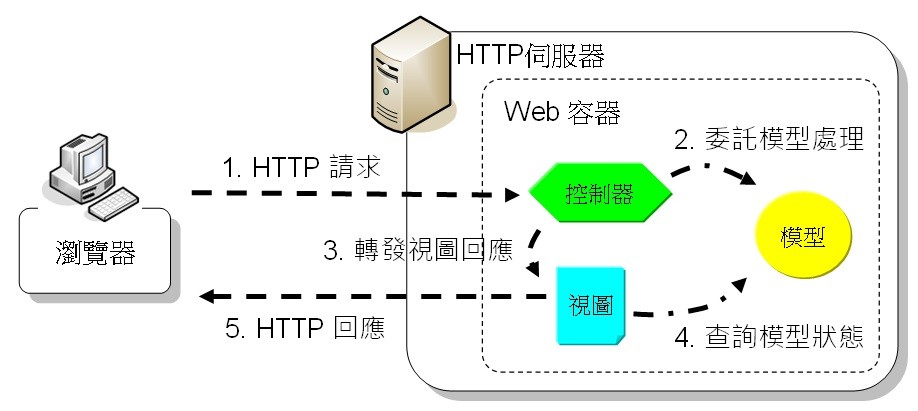

# Spring 預備知識 (一些概念性的東西)

## 預計閱讀
- MVC
- AOP
- DI,IOC
- SINGLETON
- SPRING配置(如何建立SPRING應用，包括如何配置設定檔使其運行)
- TOMCAT
- SPRINGBOOT

## MVC
[引用的參考資料](https://openhome.cc/Gossip/Spring/MVC.html)

### 傳統的桌面應用 MVC 架構如下

### 後來發現在 web 上也可以應用這樣 MVC 的概念 , 但因為 web 的 HTTP 特性(不 request 就不會有 response) , 因此誕生出 web-MVC , 如下
