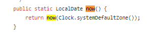
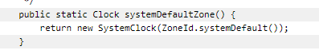

## Inner Classes 內嵌類別
- 在 java 是可以寫巢狀類別的 (類別裡面還有類別)
- 目的是在於讓這些類別可以做一個 group 讓程式碼好讀和好維護

### 小結論
modifiers 概念很重要 , 在這麼多類別中使用不同概念操作程式碼的時候 , 必須要很清楚自己在操作甚麼邏輯 , 否則很容易有問題 = ="

## abstraction 抽象
- 抽象的目的在於 "隱藏特定的細節並顯示必要的資訊給 user 即可"
- 抽象可以分為
  - 抽象類別 abstract class
  - 抽象介面 abstract interface
- abstract 是 non-access modifier -> 可用於 class 和 method
  - abstract class 抽象類別用於限制 class 不能被 new 成 object
- 用在 class 和 method 說明
  - 抽象 class : 限制 class 不能被用來創建 object (如果要拿來使用 , 必須要被繼承 inherit 在其他 class 裡面)
  - 抽象 method : 只能 "被用在抽象 class 裡" , 且創建不會有 body , body 會放在 subclass 裡宣告 
- 甚麼時候用抽象
  - 為了安全性 , 如同第一項說明的 , 隱藏特定的資料 , 並顯示必須要顯示的資料給 user 即可
  - 抽象的功能也可以用 interface 來達到

## interface 介面
- 另一種達到抽象功能的方式
- interface 是一個完整的 abstract class (抽象類別) , 是一個 "相關聯 method 的群組"  , 且 method 的 body 皆為空
- 想要操作(使用) interface 的 method 需要透過其他 class "inplements" interface 來使用(像是繼承的 inherit)
- interface 定義的空 body 方法將在 "inplement class" 中定義
- interface 核心重點
  - interface 跟抽象類別一樣 , 不能被 new 成物件
  - interface 的方法是不能有 body 的 , body 會被定義在 implement class 裡面 (介接類別)
  - 關於一個實作介接完成的 interface , 你必須定義清楚 interface 裡每一個 method 的 body
  - interface 的 method 預設為 abstract 且為 public
  - interface 的 attribute 預設為 public static 且為 final
    - 其實不難理解介面預設的 modifiers 為上述這些 , 因為 interface 像在定義最終的資料格式 , 他不應該輕易的被更改 , 但是可以被輕易的呼叫出來去使用 
- 甚麼時候用 interface (介面)
  - 為了安全 (跟抽象類別一樣)
  - :star: Java 不允許多重繼承 (就是一個類別只能繼承一個父類 , 不能有多個父類 = 只能有一個 super class) , 但是介面(interface)可以多個 class 介接(implements)
    - 這就像一個人只能有一個爸爸 , 但是可以有很多個老師 (SuperClass 就像爸爸 , interface 就像老師)

## enums 枚舉 (= ="?)
- enum 是一種特別的 class , 它定義著一組常數(constants) -> 常數: 不可改變的資料 , 就像是用 final 定義的 attributes
- 常數應該要完全寫成大寫 -> for example: MEDIUM
- 常數跟常數間用逗號隔開(comma)
- enum 與 class 的差異
  - enum 很像類別(class) , 唯一不同的是 enum 定義的常數(constants)為 "public" , "static" , "final" , 不能更改(overridden)
  - :star: enum 無法被 new 成物件(object) , 且不能繼承 class (不能 extend)  , 但是可以介接(implements)介面(interface)
- 甚麼時候該用 enum ?
  - 當你覺得你定義的資料不存在需要改變的情況 , 例如 禮拜週期 或 遊戲卡牌 等等

## user input 使用者輸入
- Scanner 類別是被用來取得 user 輸入的 , 它可以在 java.util 的 package 找到
- 使用方式: 創建一個物件 , 調用 Scanner 裡面可以使用的 method

## Date 時間
- java 沒有內建的 Date 類別 , 但可以使用 java.time package 來跟 date/time 的 api 互動 , 它有以下的 class
  - LocalDate 回應 年月日
  - LocalTime 回應 時分秒
  - LocalDateTime 回應 年月日與時分秒
  - DateTimeFormatter 格式化輸出
- 關於練習寫 code 時發現的一個問題 (為啥再調用 Date 的 Class 時不用先 new object?)
  - 在 `MyDateLab.java` 有小小的解釋
  - 主要是最後再 stackoverflow 中提到的兩句 , 在程式中調用該方法可能根本不涉及新的 object , 以 Logger 來說 , 返回的是舊的物件 , 跟新的無關
  - 以圖來說 , 我去追了 LocalDateTime 的 now() 方法 其返回的是 `return now(Clock.systemDefaultZone());`

  - 再往下追 , Clock.systemDefaultZone 的返回是 `return new SystemClock(ZoneId.systemDefault());`
